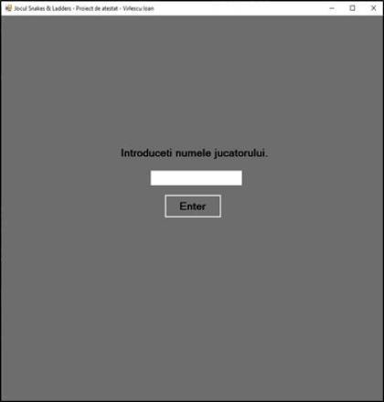
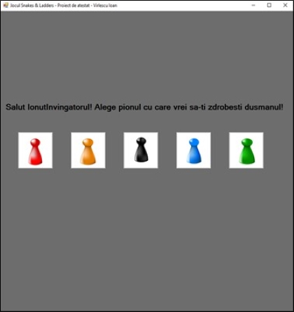
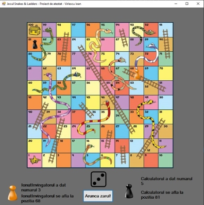

# Snakes and Ladders

### Overview
Welcome to Snakes and Ladders, a WinForms desktop application of a board game where players navigate through a grid-like board filled with snakes (which hinder progress) and ladders (which provide shortcuts). The objective is to reach the top square from the starting position by rolling a dice.

### Technologies
This Project was created with C# with GUI (WinForms) (only works on windows).

### Usage
- Clone or download this repository.
- Open the solution file (SnakesAndLadders.sln) in Visual Studio.
- Build the solution to compile the project.
- Run the application (press F5 or click the Start button in Visual Studio).
- Follow the on-screen instructions in order to choose one of the 2 game modes available (Player vs Player or Player vs PC), choose the names, the pawns and roll the dice to move your piece!
- Reach the top square to win!

### Screenshots

